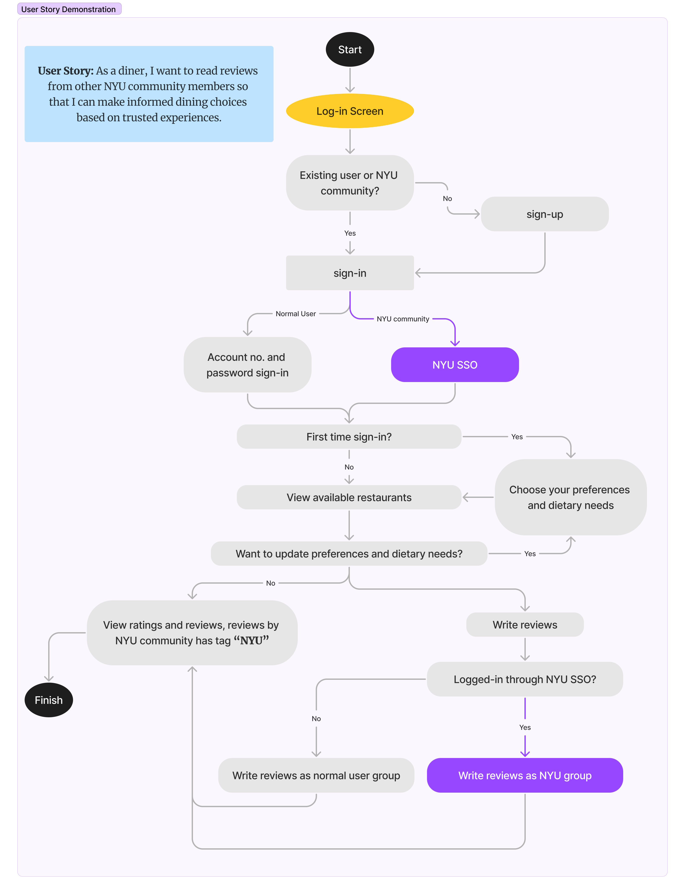
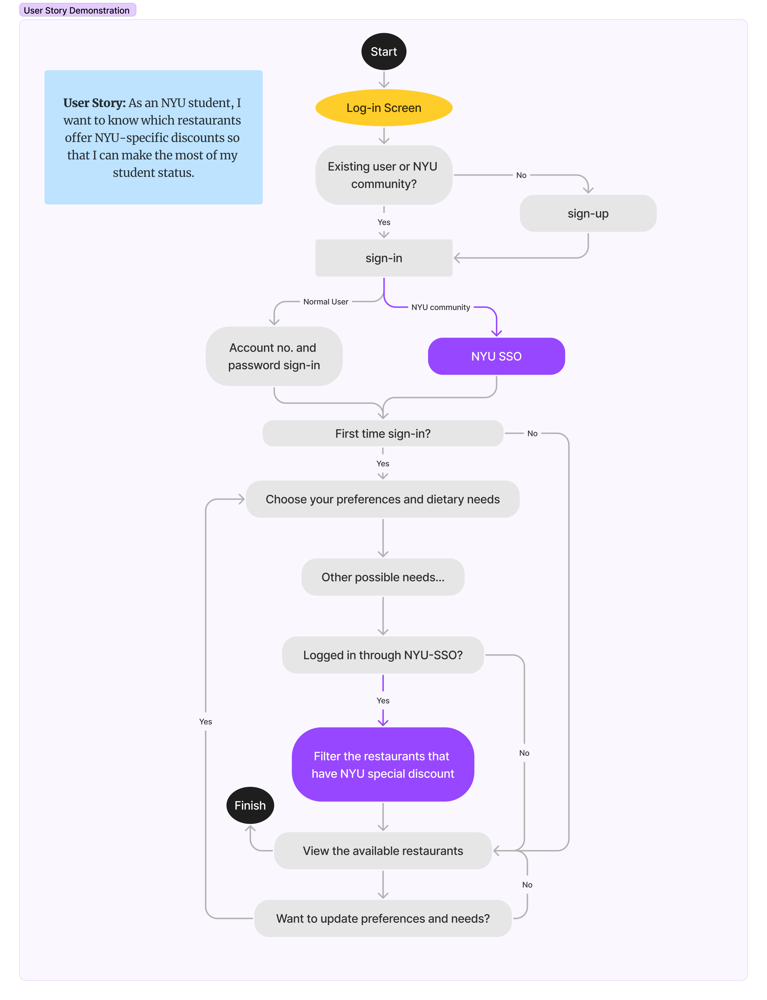

# Specification Phase Exercise

A little exercise to get started with the specification phase of the software development lifecycle. See the [instructions](instructions.md) for more detail.

## Team members

- [Xuefeng Song](https://github.com/wowwowooo)
- [Jiasheng wang](https://github.com/isomorphismss)
- [Yuantian Tan](https://github.com/AsukaTan)
- [Fuzhen Li](https://github.com/fzfzlfz)

## Stakeholders

### *Interviewed: Jason Zhang*
Senior undergraduate student majoring in Mathematics at NYU. Prefers trendy spots that is not so expensive and has a need to buy meals between classes on Mondays and Wednesdays.

**Goals/Desired Functions**: 
- List restaurants frequently visited and recommended by NYU students and faculty members.
- Users should be able to view the estimated cost per person before deciding on a restaurant.
- Need to know real-time data or at least historical data on average waiting times, especially during peak hours.
- Display restaurants based on their distance from a specified location (either from the user's specific location or a campus building).
- Highlight if the restaurant has deal or discount for NYU students.
- Book the seats in advance
- For those tight on time, give an option to order food in advance and simply pick it up (ideal for grabbing a meal between classes).

**Problems/Frustrations**: 
- Having to wait for an available table, especially during busy hours.
- Visiting restaurants without any knowledge about their food and service.
- Difficulty in identifying restaurants that cater specifically to the NYU community or offer special deals.
- Relying on a previously checked price only to discover it's outdated upon arrival, leading to unexpected expenses and a wasted trip.

### *Interviewed: Yash Patel*
Sophomore student majoring in Politics at NYU. Strict vegetarian due to personal and ethical reasons. Prioritizes dining in safe and clean areas, and has a need for parking spots.

**Goals/Desired Functions**: 
- Real-time information on available parking spots near or at the restaurant.
- Allow users to filter restaurants based on specific dietary needs, including vegetarian, kosher, halal, gluten-free, and more.
- Restaurants should provide certified information regarding their adherence to specific dietary standards.
- Suggest restaurants based on a user's past preferences, like parking needs, dietary requirements, and other preferences.
- Offer an integrated system where users can reserve a table and a parking spot at the same time.
- Provide certified reviews from people that have the same dietary needs.

**Problems/Frustrations**: 
- Relying on apps or maps that show available parking spots only to find them occupied upon arrival.
- Finding out a restaurant's "vegetarian" or "halal" dish isn't truly adhering to those standards.
- Feeling constrained to a few restaurants because of strict dietary needs, making dining out monotonous.
- Not having a trusted or standardized system to verify if a restaurant genuinely adheres to specific dietary standards, leading to apprehension and limited trust.

## Product Vision Statement

 *Name space-holder*: Empowering the NYU community with tailored dining experiences by seamlessly integrating specific preferences, safety, and convenience.

## User Requirements

- As a car owner, I want to see available parking spots near a restaurant so that I can plan my visit without parking hassles.
- As a vegetarian, I want to filter my search to only show vegetarian-friendly restaurants so that I can dine without compromising my dietary choices.
- As a safety-conscious individual, I want to know the safety rating of areas where restaurants are located so that I can dine in peace.
- As someone with religious dietary restrictions, I want to find restaurants that adhere to specific standards like halal or kosher.
- As a budget-conscious student, I want to see updated pricing for meals so that there are no unexpected costs during my visit.
- As a planner, I want to reserve both my table and parking spot simultaneously so that my dining experience is seamless from start to finish.
- As a diner, I want to read reviews from other NYU community members so that I can make informed dining choices based on trusted experiences.
- As an NYU student, I want to know which restaurants offer NYU-specific discounts so that I can make the most of my student status.
- As a normal app user, I want to personalize restaurant suggestions that are based on my past preferences that align with my tastes and needs.

## Activity Diagrams
- User Story: As a diner, I want to read reviews from other NYU community members so that I can make informed dining choices based on trusted experiences. Click <a href="https://www.figma.com/file/uFG9xNM2S3cu7MSWAnG6lJ/UML-activity-diagram-for-NYU-reviews?type=whiteboard&node-id=0%3A1&t=Yuoa7Uj9rnk3J2tt-1">here</a> or the diagram below to view it on figma.

- User Story: As an NYU student, I want to know which restaurants offer NYU-specific discounts so that I can make the most of my student status. Click <a href="https://www.figma.com/file/z7R5gxOJGUWRotY6gtpOmU/UML-activity-diagram-for-NYU-discounts?type=whiteboard&node-id=603%3A139&t=C1OaRoQZQiM0J2kh-1">here</a> or the diagram below to view it on figma.

## Wireframe Diagrams

## Clickable Prototype

See instructions. Delete this line and place a publicly-accessible link to your clickable prototype here.
